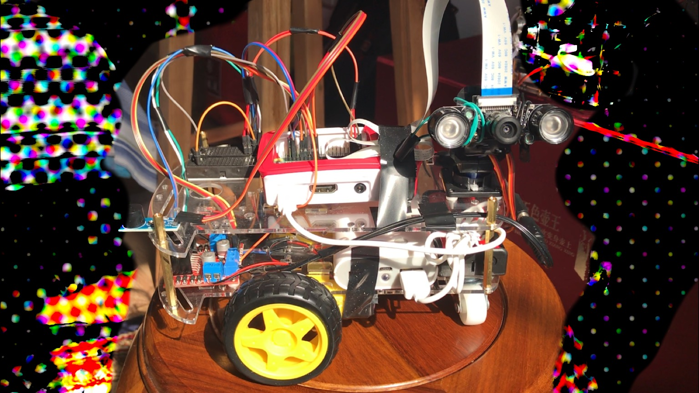
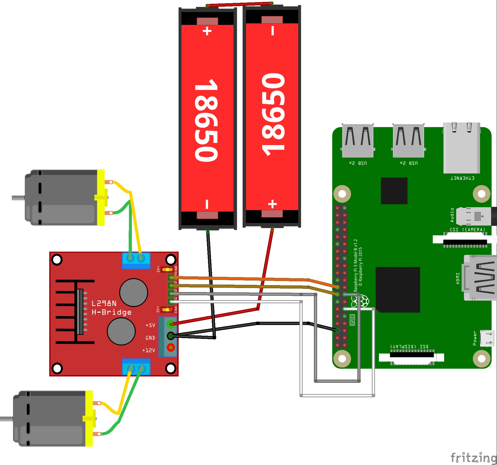
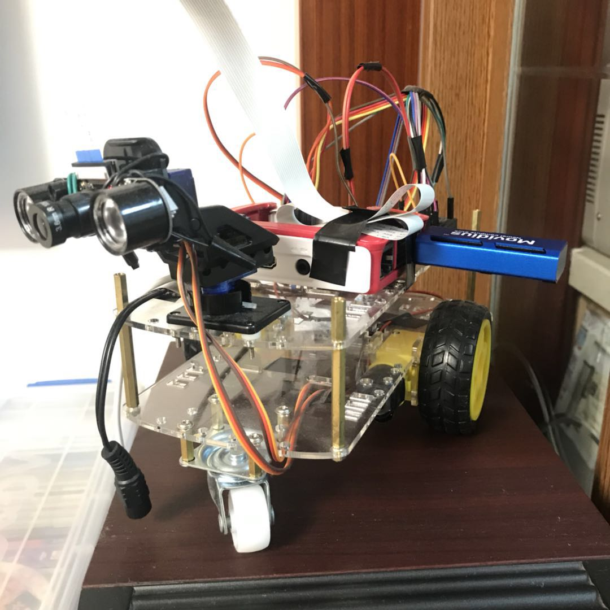
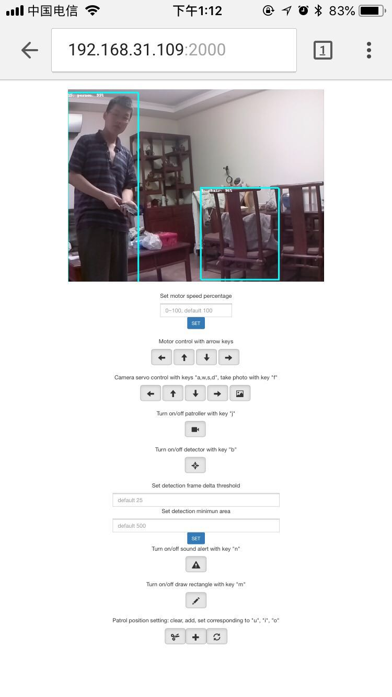

# demo

https://www.youtube.com/watch?v=RFJBnqK6Cd0&feature=youtu.be



# diagram



# setup steps:
- ```sudo raspi-config``` to enable camera and reboot Pi
- If you unfortunately delete the camera corresponding firmware like me, don't worry and check this [post](https://raspberrypi.stackexchange.com/questions/67156/how-can-i-install-raspistill-raspicam-on-a-distro-that-doesnt-include-them) to restore it. It took me 20 mins to restore Pi camera firmware.
- Verify the camera setup as ```raspistill -v -o test.jpg```, you may check the [official docs](https://www.raspberrypi.org/documentation/raspbian/applications/camera.md) for detail.

This project works on Python3 and Raspbian Stretch, dependency packages as below:
- install [picamera ](https://picamera.readthedocs.io/en/release-1.13/) module
- install [opencv](https://www.pyimagesearch.com/2017/09/04/raspbian-stretch-install-opencv-3-python-on-your-raspberry-pi/)
- install [flask](http://flask.pocoo.org/)
- install [RPi.GPIO](https://sourceforge.net/p/raspberry-gpio-python/wiki/install/)
- install [pigpio](http://abyz.me.uk/rpi/pigpio/download.html)
- install [pimodules](https://github.com/ronjian/pimodules)
- download this project ```git clone https://github.com/ronjian/Security-Monitor-Pi-Robot.git```
- place email password ```echo "your password" > ./src/password.txt```
- change the configures ```./src/conf.ini``` to your owns'

# start the server and check the log:
```
nohup python3 ./src/server.py &
tail -f ./src/myapp.log
```


Open url ```http://192.168.1.110:2000/```(replace with your own Pi's IP address) in your browser.  

# steps to add this project into system service:

```shell
sudo vi /etc/systemd/system/security_monitor.service
```
Add below:  
```
[Service]
WorkingDirectory=/home/pi/security_monitor/src/
ExecStart=/home/pi/security_monitor/src/server.py
Restart=always
StandardOutput=syslog
StandardError=syslog
SyslogIdentifier=security_monitor
User=root
Group=root

[Install]
WantedBy=multi-user.target
```
Enable and start service, this service will be automatically kick off next time reboot.
```shell
sudo systemctl enable security_monitor.service
sudo systemctl start security_monitor.service
```
Stop the process  
```shell
sudo systemctl stop security_monitor.service
sudo systemctl disable security_monitor.service
```
Check log is fine  
```shell
systemctl -l status security_monitor
```

# Mapping the internal web server (192.168.31.109:20000) to the Internet (http://209640a7u0.iok.la:20705/)

please follow this documents. Please note the application will charge a little money.
- http://service.oray.com/question/2680.html

# Update

## Intergrate The Intel® Movidius™ Neural Compute Stick to do inference of deep neural network

Install NC SDK:
```git clone -b ncsdk2 http://github.com/Movidius/ncsdk && cd ncsdk && make install```

I borrow the idea from ncappzoo and change the NCAPI from V1 to V2
 to detect person via MobileNet-SSD deep nueral network.

- https://github.com/movidius/ncappzoo/tree/master/apps/security-cam

Device and webpage screenshot:





## Push to Internet using autossh tunnel

### Reference:
- https://blog.csdn.net/upshi/article/details/78630285
- https://blog.windrunner.me/sa/reverse-ssh.html

### command of this case:

```shell
sudo vi /etc/systemd/system/remote-autossh.service
```
Add below (Note that __ecs__ is configured in my __/etc/hosts__ file:  
```
[Unit]
Description=AutoSSH service for remote tunnel
After=network.target

[Service]
User=pi
Environment="AUTOSSH_GATETIME=0"
ExecStart=/usr/bin/autossh -M 6666 -N -o "PubkeyAuthentication=yes" -o "StrictHostKeyChecking=false" -o "ServerAliveInterval 60" -o "ServerAliveCountMax 3" -R 80:127.0.0.1:2000 root@ecs

[Install]
WantedBy=multi-user.target
```
Enable and start service, this service will be automatically kick off next time reboot.
```shell
sudo systemctl daemon-reload
sudo systemctl start remote-autossh
sudo systemctl enable remote-autossh.service
```
check log
```shell
systemctl -l status remote-autossh
```

